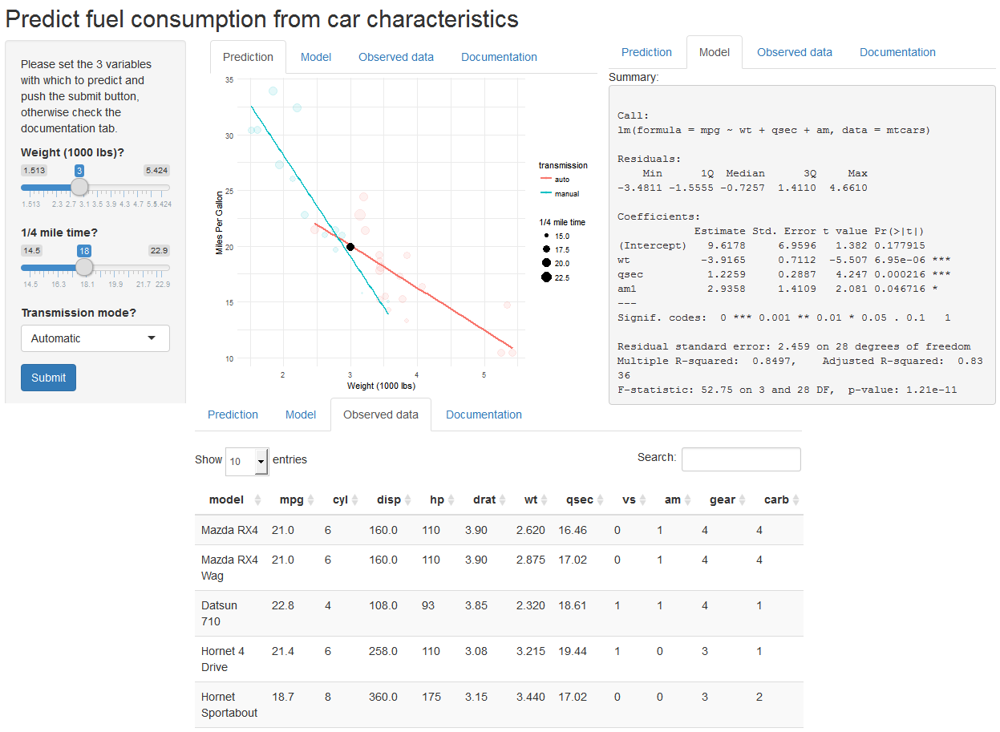

Predict Fuel Consumption Application
========================================================
author: Mauricio Ramos
date: January 25, 2018
autosize: false

Overview
========================================================

This is about a [shiny](http://shiny.rstudio.com/) web application that predicts car fuel consumption using a linear regression model developed over a dataset extracted from the 1974 Motor Trend Car US Magazine (mtcars).

The goal is to predict the miles per gallon given the predictors weight, the quarter of mile time and weather the transmission is manual or automatic.  More details on this specific regression model development please visit a previous report on <https://mauriciocramos.github.io/mtcars-regmodel/README.pdf>.


A sample of the mtcars dataset
========================================================


```r
knitr::kable(head(mtcars, 5))
```


|                  |  mpg| cyl| disp|  hp| drat|    wt|  qsec| vs| am| gear| carb|
|:-----------------|----:|---:|----:|---:|----:|-----:|-----:|--:|--:|----:|----:|
|Mazda RX4         | 21.0|   6|  160| 110| 3.90| 2.620| 16.46|  0|  1|    4|    4|
|Mazda RX4 Wag     | 21.0|   6|  160| 110| 3.90| 2.875| 17.02|  0|  1|    4|    4|
|Datsun 710        | 22.8|   4|  108|  93| 3.85| 2.320| 18.61|  1|  1|    4|    1|
|Hornet 4 Drive    | 21.4|   6|  258| 110| 3.08| 3.215| 19.44|  1|  0|    3|    1|
|Hornet Sportabout | 18.7|   8|  360| 175| 3.15| 3.440| 17.02|  0|  0|    3|    2|

Application screenshots
========================================================



Application access and source code
========================================================

The application is available at <https://mauriciocramos.shinyapps.io/mtcars-predict/>

The source code is available at <https://github.com/mauriciocramos/mtcars-predict>

Shiny framework is available at <http://shiny.rstudio.com/> and <https://cran.r-project.org/web/packages/shiny/index.html>.

Enjoy it!
